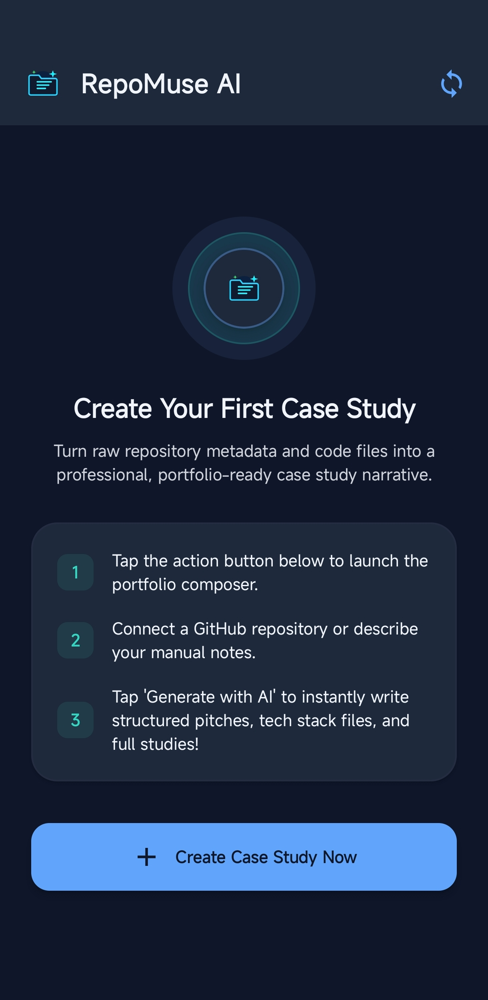
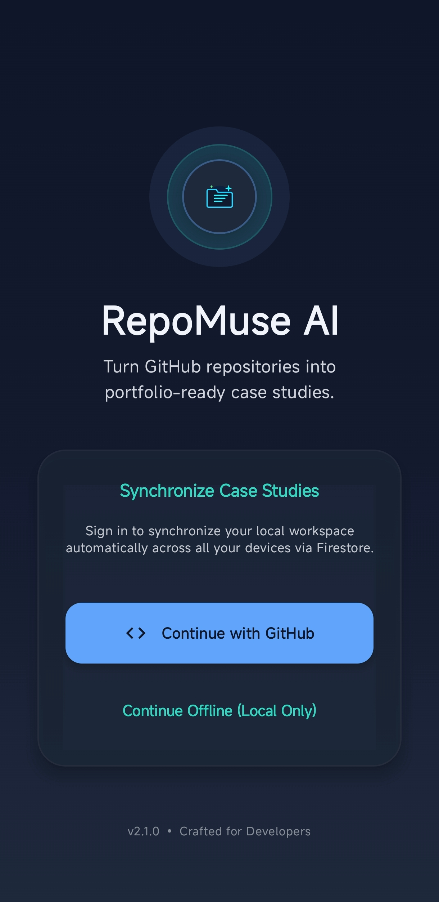

# 🚀 RepoMuse AI

**RepoMuse AI** is a modern, native Android application that empowers developers to instantly turn their public GitHub repositories into professional, portfolio-ready case studies. Powered by Google's **Gemini 3.5 Flash** and integrated with the GitHub REST API, RepoMuse automates the writing of pitches, problem statements, core features, technical challenges, and resume bullet points to help you showcase your work to recruiters and peers.

---

## 🎨 Screen Showcase

<p align="center">
  
  
</p>

---

## ✨ Features

*   **🔍 Auto-Extraction from GitHub:** Paste any public repository URL to automatically fetch its primary language, topics, and description.
*   **🧠 AI Case Study Generation:** Leverages Google's **Gemini 3.5 Flash** to draft custom pitches, problem statements, detailed technical challenges, and high-impact resume bullets.
*   **🔄 Offline-First with Hybrid Sync:**
    *   **Offline Mode:** Fully functional offline local storage powered by **Room Database**.
    *   **Cloud Sync:** Real-time synchronization across devices using **Cloud Firestore** when signed in with GitHub.
*   **🔐 GitHub Auth Integration:** Seamless GitHub authentication handled via Firebase Authentication.
*   **📄 Export to PDF:** Formulates and compiles your finished case study into a structured, elegant PDF document saved directly to your device's Downloads folder.
*   **📱 Responsive & Fluid UI:** Fully styled using **Material Design 3 (M3)** with custom dark-mode aesthetics, responsive layouts, and helpful notifications.

---

## 🛠️ Tech Stack

*   **Language:** Kotlin (100% Native)
*   **UI Framework:** Jetpack Compose (Material Design 3)
*   **Architecture:** MVVM (Model-View-ViewModel) with Kotlin Coroutines & Flow
*   **Local Storage:** Room Database (SQLite SQLite-wrapper)
*   **Cloud Backend:** Firebase (Auth, Firestore)
*   **AI Engine:** Google Gemini SDK (`gemini-3.5-flash`)
*   **HTTP Client:** OkHttp & Retrofit (for interacting with the public GitHub REST API)
*   **PDF Generation:** Android Graphics (`PdfDocument`, Canvas, & Paint APIs)

---

## 📂 Project Structure

```text
├── app/
│   ├── src/main/
│   │   ├── java/com/example/
│   │   │   ├── RepoMuseApplication.kt     # Application entry-point
│   │   │   ├── MainActivity.kt            # Core activity hosting Compose Navigation
│   │   │   ├── data/                      # Data layer (Models, Room, Services, Repositories)
│   │   │   │   ├── AppDatabase.kt         # Room database configuration
│   │   │   │   ├── Project.kt             # Case study entity model (uses UUID primary key)
│   │   │   │   ├── ProjectDao.kt          # Room query statements
│   │   │   │   ├── ProjectRepository.kt   # Hybrid repository coordinating Room and Firestore
│   │   │   │   ├── GeminiService.kt       # API handler calling Google's Gemini models
│   │   │   │   └── GitHubService.kt       # Repository fetcher via GitHub REST API
│   │   │   ├── ui/                        # Presentation layer
│   │   │   │   ├── ProjectViewModel.kt    # VM managing case study states, inserts, and sync
│   │   │   │   ├── screens/               # Screen composables
│   │   │   │   │   ├── HomeScreen.kt          # Interactive dashboard list
│   │   │   │   │   ├── LoginScreen.kt         # Auth handler & offline skip option
│   │   │   │   │   ├── AddEditProjectScreen.kt# AI generation form & custom field editor
│   │   │   │   │   └── ProjectDetailScreen.kt # Details view with PDF export trigger
│   │   │   │   └── theme/                 # App color palettes, typographies, and styles
│   │   │   └── utils/                     
│   │   │       └── PdfExporter.kt         # Canvas-drawn PDF generator
│   │   └── res/                           # Layouts, strings, drawables, and XML resource assets
│   └── build.gradle.kts                   # App-level build config
├── gradle/                                # Shared Version Catalog & Gradle configurations
├── build.gradle.kts                       # Project-level build config
├── settings.gradle.kts                    # Modules configuration
├── .env.example                           # Template for secure API environment keys
└── PROJECT_GUIDE.md                       # Comprehensive guide with code audit metrics
```

---

## ⚙️ How to Set Up & Run Locally

Follow these steps to open, configure, and compile **RepoMuse AI** using Android Studio.

### Prerequisites
*   Install the latest version of [Android Studio](https://developer.android.com/studio) (Ladybug or newer recommended).
*   Install JDK 17 (bundled automatically with modern Android Studio).

---

### Step 1: Clone and Open the Project
1. Clone the repository to your local machine:
   ```bash
   git clone https://github.com/YOUR_USERNAME/RepoMuse.git
   ```
2. Open Android Studio.
3. Select **File -> Open** (or **Open an Existing Project** from the welcome screen).
4. Navigate to the folder where you cloned the repository and click **OK**.
5. Wait for Gradle to download all dependencies and sync the project.

---

### Step 2: Configure Your Gemini API Key
RepoMuse utilizes the **Secrets Gradle Plugin** to securely inject credentials at build time.

1. In the root directory of the project, create a new file named `.env`:
   ```bash
   # Root directory level
   touch .env
   ```
2. Open the `.env` file and insert your active Google AI Studio Gemini API Key:
   ```env
   GEMINI_API_KEY=AIzaSyYourGeminiApiKeyHere
   ```
   *(You can obtain a free Gemini API key from the [Google AI Studio Console](https://aistudio.google.com/)).*

---

### Step 3: Set Up Firebase
To enable cloud synchronization and GitHub OAuth login, you must link the app to your own Firebase project.

1. Go to the [Firebase Console](https://console.firebase.google.com/).
2. Click **Add Project** and follow the prompts to create a new project.
3. Register a new **Android App** inside your project settings:
    *   **Android Package Name:** `com.aistudio.repomuse.mxyzp` (Verify your target `applicationId` in your `app/build.gradle.kts`).
4. Download the `google-services.json` configuration file.

---

### Step 4: Add `google-services.json` (Security-Safe)
Since our repository ignores active configurations for security reasons (to prevent credential scans):

1. Paste your downloaded `google-services.json` directly into the `app/` folder of the project.
   ```text
   RepoMuse/
   ├── app/
   │   ├── google-services.json  <-- PLACE FILE HERE
   │   └── build.gradle.kts
   ```
2. *Note: A safe template is also provided at `app/google-services.example.json` for reference.*

---

### Step 5: Enable Authentication & Firestore Database

#### 1. Enable GitHub Sign-In
1. In the Firebase Console, navigate to **Authentication -> Sign-in method**.
2. Click **Add new provider** and choose **GitHub**.
3. Toggle to **Enable**.
4. To complete setup, register an **OAuth Application** on GitHub:
    *   Go to **GitHub Settings -> Developer Settings -> OAuth Apps -> Register a new application**.
    *   Copy the **Authorization Callback URL** shown in the Firebase Console and paste it into GitHub.
    *   Copy the **Client ID** and **Client Secret** generated by GitHub and paste them back into the Firebase Console prompt. Click **Save**.

#### 2. Enable Cloud Firestore
1. Navigate to **Firestore Database** in the Firebase Sidebar and click **Create Database**.
2. Deploy the following security rules to ensure user-isolated storage:
   ```javascript
   rules_version = '2';
   service cloud.firestore {
     match /databases/{database}/documents {
       match /users/{userId}/projects/{projectId} {
         allow read, write: if request.auth != null && request.auth.uid == userId;
       }
     }
   }
   ```

---

### Step 6: Compile & Run!
1. Connect an Android Device via USB (with **USB Debugging** turned on) or start a Virtual Device (Emulator) inside Android Studio.
2. Select the `app` configuration in the toolbar and click the green **Run (Play)** button.
3. Alternately, compile and install directly from the built-in Android Studio terminal:
   ```bash
   ./gradlew installDebug
   ```

---

## 🔒 Security Best Practices

*   **API Key Protection:** The `.env` file and `google-services.json` are listed in `.gitignore` and are excluded from version control. Never commit them to a public repository.
*   **Rotation:** If you ever expose an active key accidentally, immediately rotate it on the [Google Cloud Credentials Console](https://console.cloud.google.com/apis/credentials) and dismiss any alerts.

---

## 💡 Contributing & Feedback

If you find a bug, have optimization suggestions, or want to contribute new layout templates for PDF exports:
1. Open an issue detailing your suggestions.
2. Fork the repository, apply your changes, and submit a Pull Request!

*Happy Documenting! ✍️*
